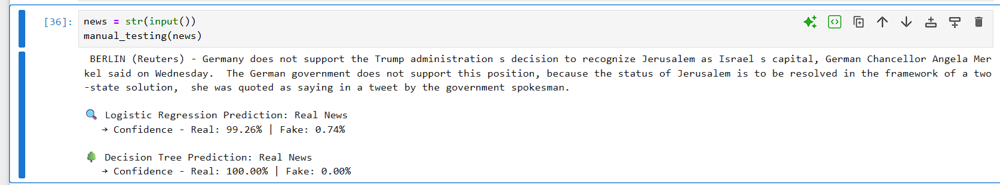

# 📰 Fake News Detection System

A machine learning project that builds and evaluates models to classify news articles as **fake** or **real** based on their content. The dataset includes labeled text samples from actual and fake news sources.


## 📁 Project Structure
- **Fake.csv**: Dataset containing fake news samples.
- **True.csv**: Dataset containing real news samples.
- Source: Kaggle - [Fake and Real News Dataset](https://www.kaggle.com/clmentbisaillon/fake-and-real-news-dataset)
- **Notebook**: Contains data preprocessing, model training, evaluation, and testing logic.

## ⚙️ Technologies Used

- Python 3.x
- Pandas
- NumPy
- Seaborn & Matplotlib
- Scikit-learn

## 🚀 Features

- Loads and merges real and fake news datasets.
- Cleans and preprocesses news content.
- Converts text to numerical features using `TfidfVectorizer`.
- Splits data into training and testing sets (70/30 split).
- Trains and evaluates two machine learning models:
  - Logistic Regression
  - Passive Aggressive Classifier
- Prints accuracy, classification report, and confusion matrix for both models.
- Includes manual testing on reserved samples.

## 🧪 Data Preprocessing Steps

1. Merged fake and real datasets, labeling:
   - Fake: `class = 0`
   - Real: `class = 1`
2. Dropped metadata columns: `title`, `subject`, `date`.
3. Cleaned text using:
   - Lowercasing
   - Removing punctuation and stopwords
   - Removing hyperlinks, mentions, and extra spaces

```python
def wordopt(text):
    text = text.lower()
    text = re.sub('\[.*?\]', '', text)
    text = re.sub("\\W"," ",text)
    text = re.sub('https?://\S+|www\.\S+', '', text)
    text = re.sub('<.*?>+', '', text)
    text = re.sub('[%s]' % re.escape(string.punctuation), '', text)
    text = re.sub('\n', '', text)
    text = re.sub('\w*\d\w*', '', text)
    return text
```
4. Used `TfidfVectorizer` to transform text into numerical feature vectors.

---

## 🤖 Models Used
### 1. Logistic Regression<br>
 - Trained on TF-IDF features.<br>
 - Accuracy and classification report printed.<br>

### 2. Decision Tree Classifier<br>
 - Alternative model evaluated on the same features.<br>
 - Results compared for performance insights.<br>

 ---

## 📊 Evaluation Metrics
- Accuracy Score

- Confusion Matrix

- Classification Report (Precision, Recall, F1-score)

---

## ✅ Example Output

- Logistic Regression Accuracy: ~98%

- Decision Tree Classifier Accuracy: ~99%

- Confusion matrix and report available in the notebook.

  
  

  ---
## 🧪 Manual Testing

10 fake and 10 real news entries reserved and tested against the models to evaluate generalization.

---

## 📌 How to Run
1. Clone the repository:
```bash
git clone https://github.com/PankajKumar-11/fake-news-detection.git
cd fake-news-detection
```

2. Install dependencies:
```bash
pip install -r requirements.txt
```
3. Run the notebook using Jupyter or JupyterLab.

---

## 📄 License
This project is open-source and available under the MIT License.

---
### 🙋‍♂️ Author
Pankaj Kumar<br>
GitHub: [@PankajKumar-11](https://github.com/PankajKumar-11)


